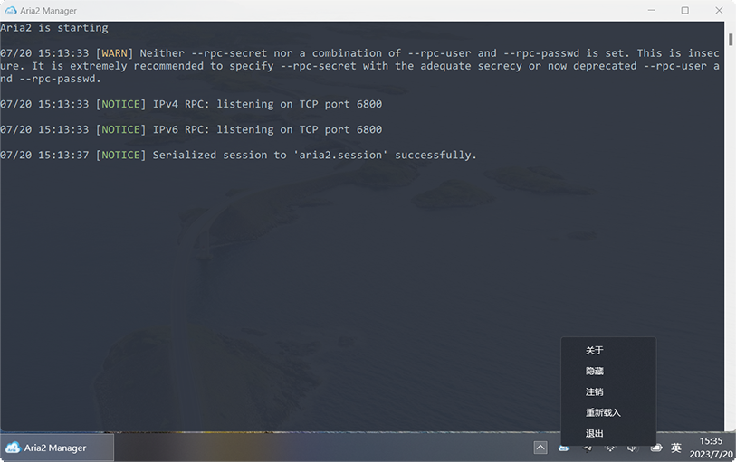

# Aria2 Manager

Aria2 Manager is a useful tool that allows user to run [Aria2](https://github.com/aria2/aria2) in the background easily. (Only for Windows)

## Usage

- For new user, please download the full version zip which already includes **aria2c.exe** and configuration files. Just extract it and run **Aria2Manager.exe**. Then, the extension should work well with default RPC settings.

- For advanced user, please download standalone version and extract **Aria2Manager.exe** to the directory where aria2c.exe exists, and rename your configuration file to **aria2.conf**. Then, you could start up Aria2 in the background by running **Aria2Manager.exe**.

- For [Aria2 Explorer](https://github.com/alexhua/aria2-explorer) user, regarding the `Start Aria2` and `Open Download Folder` features, the extension needs to implement them through the use of **Aria2 Manager**. To enable these features, please run **Aria2 Manager.exe** as an administrator and click on `Register` in the option menu to set **Aria2Manager.exe** as the default application for the `aria2://` protocol at first time. Once the registration is successful, users could click on `Unregister` to unregister **Aria2Manager.exe** from the `aria2://` protocol if you do not need it anymore. （Requirement: Version ≥ v1.1）

## Screenshot

## Install 

## Reference 

- https://github.com/phuslu/taskbar
- https://github.com/RossWang/Aria2-Integration
